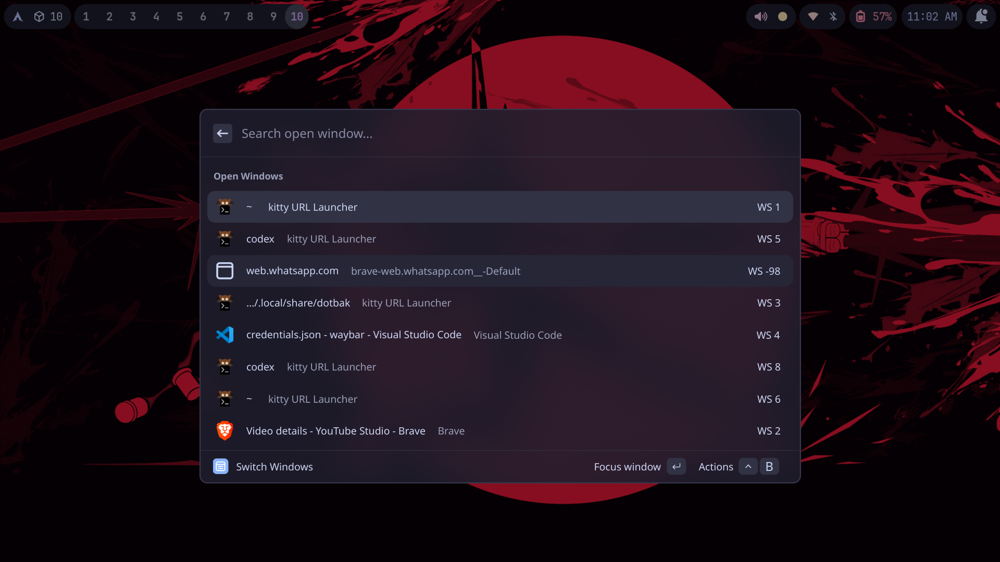
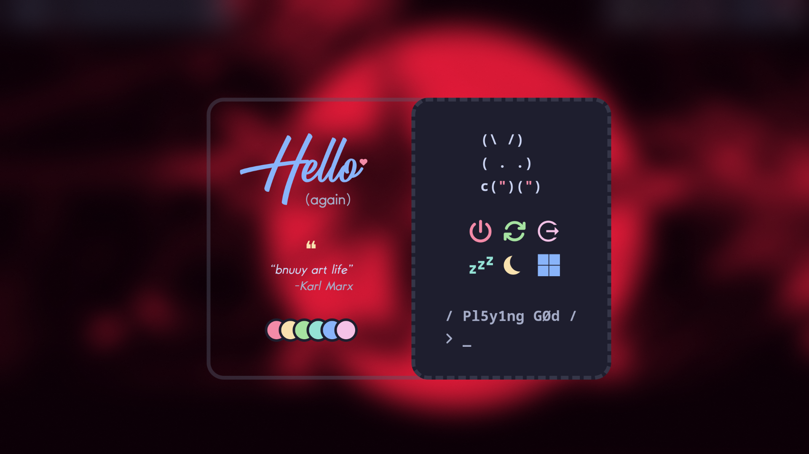
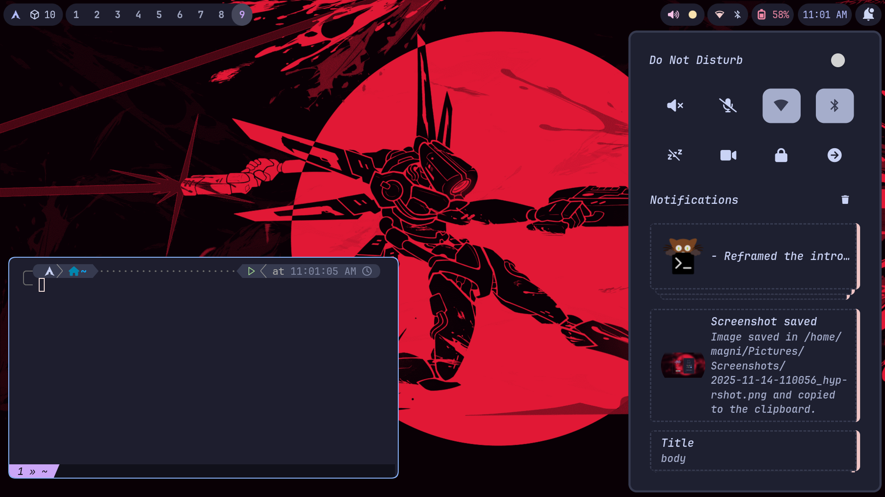
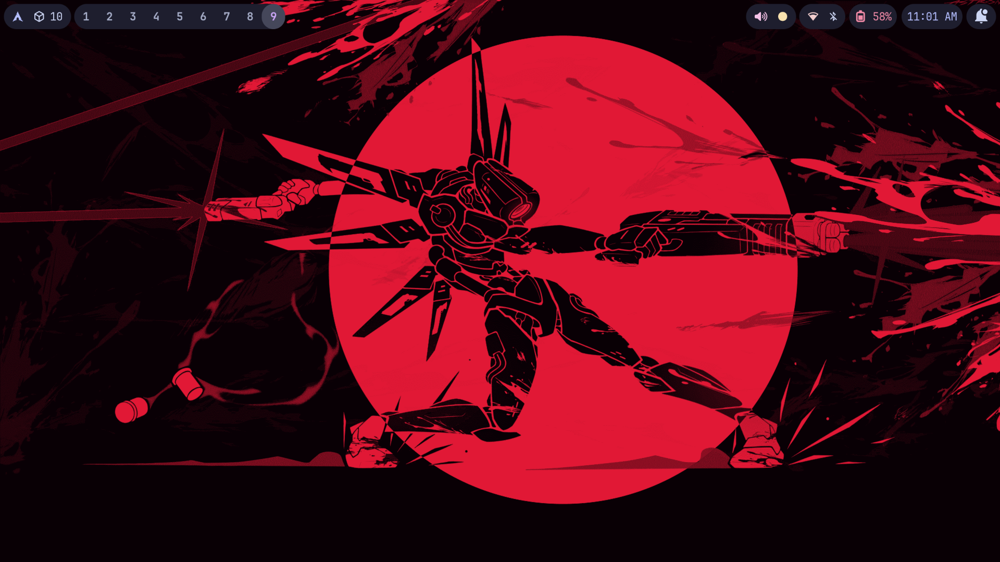
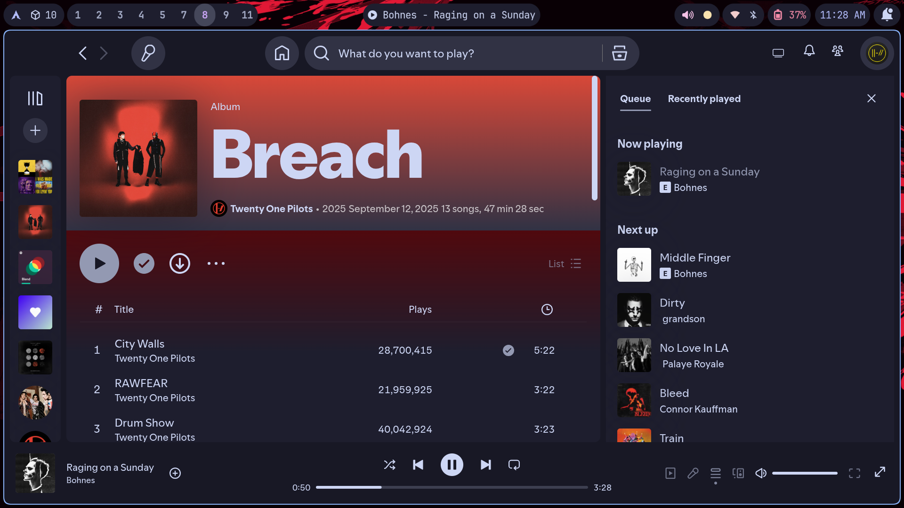

# Magni's Dotfiles 🗂️

## Overview
Personal configuration bundle based on the [catppuccin theme](https://catppuccin.com/) for my Wayland desktop. Everything you see in `managed/` is what I keep under version control—Hyprland, Waybar, Rofi, Kitty, swaync, custom scripts, systemd user units, and assorted app configs. If you want a quick vibe check before digging in, watch the (now slightly outdated) overview video:

[](https://www.youtube.com/watch?v=WN2NNv5WEAE "Magni dotfiles overview")

- Wayland-first workflow (Hyprland + Waybar) with Catppuccin-inspired theming.
- Launchers/menus powered by Rofi, including Bluetooth, network, clipboard, and calculator helpers.
- Notifications via swaync (with dunst kept as a backup), plus shell scripts for wifi, Bluetooth, and idle-inhibit toggles.
- A small collection of user services (eww, hyprsunset, vicinae, etc.) to keep long-running helpers contained.
- Shell/Zsh configs currently live in a separate repo: [Magniquick/zsh-dots](https://github.com/Magniquick/zsh-dots) and are managed independently for now.

A tiny helper tool called [dotbak](https://github.com/Magniquick/dotbak) keeps these files mirrored into `managed/`, but you do not need it unless you want the same backup workflow.

## Gallery
<table>
  <tr>
    <td></td>
    <td></td>
  </tr>
  <tr>
    <td></td>
    <td></td>
  </tr>
  <tr>
    <td></td>
    <td></td>
  </tr>
</table>

## Highlights
- `managed/config/hypr/` – layered Hyprland setup split into appearance, keybinds, inputs, monitors, and scripts (screenshots, music art, wireless menus, lock screen profiles).
- `managed/config/waybar/` – JSONC config with themed CSS plus Python/shell scripts for status segments.
- `managed/config/rofi/` – launcher profiles, shared color palettes, and helper binaries for menus.
- `managed/local/bin/custom/` – mini utilities (browser vacuum, WhatsApp wrapper, Typst launcher).
- `managed/config/systemd/user/` – user services, sockets, and target wants for background daemons.
- `managed/config/swaync/` – primary notification styling/behavior, with `managed/config/dunst/` retained as an alternate fallback.
- `managed/config/eww/` – powermenu widget with animations and shared color variables.
- `managed/config/hypr/hyprlock/` – themed hyprlock layouts matching the rest of the desktop.

## Requirements & Tooling
- Linux desktop with Wayland; most configs assume Hyprland and wlroots-compatible components.
- `git` for cloning and keeping files up to date.
- The programs referenced inside (Hyprland, Waybar, Rofi, Kitty, swaync, eww, systemd user services, etc.).
- Optional: [dotbak](https://github.com/Magniquick/dotbak) if you want to mirror the same workflow of syncing files into `managed/`.

## Getting Started
1. Clone the repo wherever you keep dotfiles:
   ```bash
   git clone https://github.com/Magniquick/dotbak.git ~/.local/share/dotbak
   cd ~/.local/share/dotbak
   ```
2. Skim `managed/` to decide which components you actually want. Most directories map 1:1 with `$HOME/.config`, `$HOME/.local/share`, or `$HOME/.local/bin`.
3. If you use dotbak, you can restore everything at once:
   ```bash
   dotbak restore
   ```
   Add `--group <name>` to scope the restore or `--force` once you’ve reviewed the plan.
4. Prefer manual control? Symlink specific components into place. Example (Hyprland + Waybar):
   ```bash
   ln -s ~/.local/share/dotbak/managed/config/hypr ~/.config/hypr
   ln -s ~/.local/share/dotbak/managed/config/waybar ~/.config/waybar
   ```
5. Repeat for other tools (Rofi, Kitty, swaync, eww, scripts, systemd units). Reload each app/service to pick up the new configuration.

> [!IMPORTANT]
> Some configs ship as templates (files ending in `.tmpl`) that you **must** edit before use—API tokens, credentials, etc. Quickly list them with `find managed -name '*.tmpl'` and update each copy after restoring (for example, edit `~/.config/waybar/scripts/credentials.json.tmpl` with your own keys).

> [!TIP]
> Keep a backup of your existing configs before linking mine in, especially for Hyprland or shell startup files.

> [!NOTE]
> If you prefer automagical setup, check out [Dotbak](https://github.com/Magniquick/dotbak). I run it locally to keep `managed/` in sync, but it’s not bundled here.

## Repository Layout
```
managed/
├── config/
│   ├── hypr/
│   ├── waybar/
│   ├── rofi/
│   ├── kitty/
│   ├── swaync/
│   ├── eww/
│   ├── systemd/
│   └── ...
├── local/
│   ├── bin/custom/
│   └── share/applications/
└── manifest.toml   # inventory of tracked entries
dotbak.toml         # mapping of source paths → managed copies
```

- Anything under `managed/config` is meant to live under `~/.config`.
- `managed/local/bin/custom` holds scripts destined for `~/.local/bin/custom`.
- `managed/local/share` covers desktop entries and icons.
- `dotbak.toml`/`managed/manifest.toml` exist because I mirror entries with dotbak; treat them as documentation unless you’re adopting the same tool.

## Customization Tips
- **Hyprland**: tweak `managed/config/hypr/hyprland/*.conf`—the files are split by theme (appearance, keybinds, inputs, etc.) to keep overrides clean.
- **Waybar**: edit `managed/config/waybar/style.css` or theme-specific CSS, and adjust modules in `config.jsonc`.
- **Rofi**: color palettes live in `managed/config/rofi/config/colors.rasi`; each mode (clipboard, launcher, network, etc.) has its own `*.rasi`.
- **Systemd user units**: symlink files into `~/.config/systemd/user/`, run `systemctl --user daemon-reload`, then `systemctl --user enable --now <service>`.

## Maintenance
- Pull updates with `git pull` to keep configs synchronized across machines.
- Review diffs before applying to ensure no system-specific paths (e.g., monitor names) need tweaking.
- If you adopt dotbak, point it at `dotbak.toml` and run `dotbak apply` to keep symlinks consistent; otherwise manage links manually with your preferred tool.

## Inspiration & Credits
- [elenapan/dotfiles](https://github.com/elenapan/dotfiles) – reference for the eww-powered powermenu and general layout/theme ideas.

## License
GPLv3. Use any pieces you like, tweak them to your taste, and feel free to reference the repo when sharing your own setup.
